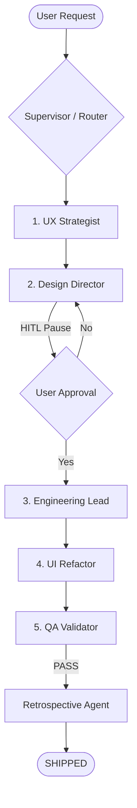
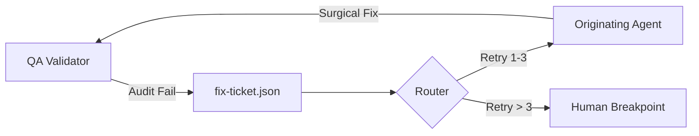
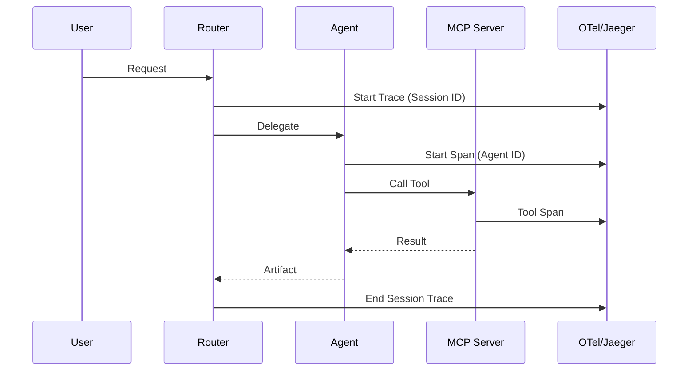

# 🗺️ System Architecture

This document visualizes the hierarchical, state-aware, and self-healing nature of the AI Skills Workspace.

---

## 1. The 5-Phase Workflow
The Supervisor manages the linear progression from product strategy to validated implementation.

---

## 2. The Self-Healing Reflection Loop
If a validation gate or MCP tool fails, the system automatically attempts a surgical fix.

---

## 3. Observability Waterfall
Every turn is traced via OpenTelemetry (OTel) using GenAI semantic conventions.

